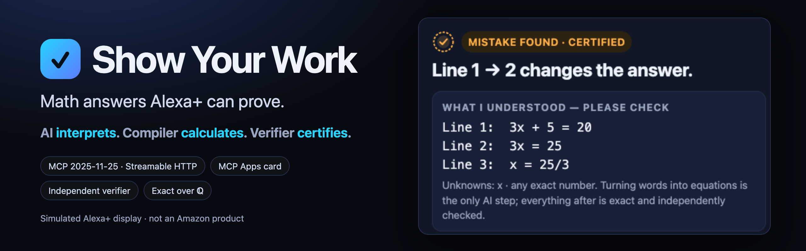
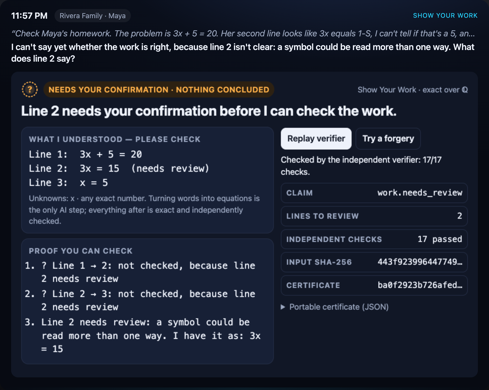
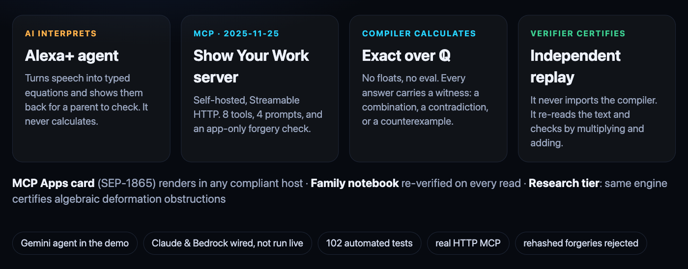
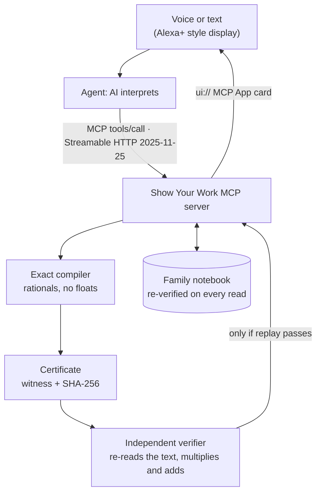

<p align="center">
  
</p>

<p align="center">
  <a href="https://github.com/Akari-H-111/algebraic-constraint-compiler/actions/workflows/ci.yml"></a>
  
  
  
  <a href="LICENSE"></a>
</p>

<p align="center">
  <a href="https://youtu.be/MAS9ZeFuNRg"><b>▶ Demo video (2:54)</b></a> ·
  <a href="https://akari-h-111.github.io/algebraic-constraint-compiler/"><b>Try it in your browser</b></a> ·
  <a href="#use-it-from-any-mcp-host"><b>Public MCP endpoint</b></a> ·
  <a href="https://devpost.com/software/algebraic-constraint-compiler"><b>Devpost</b></a>
</p>

# Show Your Work

Show Your Work is an MCP server plus a **simulated** Alexa+ smart display (not an
Amazon product). It checks a child's math homework and never says "correct"
unless an independent verifier has replayed an exact proof.

- **It finds the exact line** where the work goes wrong, with a counterexample you can check by hand.
- **It says "no" and "not sure" honestly:** word problems that can't be true as written are
  certified impossible, and a line that is ambiguous or doesn't parse as an equation is held for
  review instead of guessed. (It does no handwriting recognition: the host model reads the page.)
- **Every result is a portable certificate** that anyone can re-check without trusting the assistant.


> [!TIP]
> **No install needed:** the [web demo](https://akari-h-111.github.io/algebraic-constraint-compiler/) runs the real
> Python compiler and verifier in your browser (Guided requests, no AI). Point any MCP client at the public
> endpoint `https://show-your-work-mcp.onrender.com/mcp` (free instance: the first request can take about
> 50 seconds to wake it). To ask in your own words (typed or spoken) with the Claude or Gemini agent, [run it locally](#try-it-in-two-minutes).

## Why

Just over half of U.S. teens have used AI chatbots for schoolwork, and about
four in ten have used them to solve math problems. Parents underestimate how
often this happens ([Pew Research Center, 2026](https://www.pewresearch.org/internet/2026/02/24/how-teens-use-and-view-ai/);
survey of 1,458 teens and parents, Sept–Oct 2025). Language models sound sure
of themselves, but they are fragile at math: in Apple's GSM-Symbolic study,
accuracy dropped when only the numbers in a problem changed, and by up to 65%
when one irrelevant clause was added
([Mirzadeh et al., 2024](https://machinelearning.apple.com/research/gsm-symbolic)).

A parent at the kitchen counter can't tell a correct explanation from a
confident wrong one. A voice assistant in the home shouldn't make them guess.

## What it does

| Ask Alexa… | Show Your Work returns (all certified) |
|---|---|
| "Check Maya's homework: 3x + 5 = 20, then 3x = 25, then x = 25/3." | **The first step that changes the answer**, with a counterexample: x = 5 works before the step but gives 15 ≠ 25 after it. A labelled, uncertified hint: "when +5 moves across, it becomes −5". |
| "Adult tickets $12, child $7, 20 tickets for $300. How many child tickets?" | **No valid answer:** the only exact solution is −12 child tickets. The worksheet has a typo, proved by combining the two equations. |
| "Maya says x = 4 for 2x − 7 = 1. Right?" | **Correct**, by substitution, and it is the only solution. |
| "Give her a practice problem like that." | A fresh problem whose answer key the verifier has already checked, hidden until someone asks. |
| "How is Maya doing this week?" | A summary rebuilt from the notebook. Every stored certificate is replayed first, and the most common slip is named. |

The card on screen is an **MCP App** (SEP-1865, the open standard for
interactive UI in MCP). It is written only against that standard, so the same
certificate is meant to render inline in any MCP Apps host (Claude, ChatGPT,
VS Code, Goose, …). It is tested here in the simulator, which implements the
host side of the spec, including the cross-origin sandbox proxy. Its buttons
call back into the server: **Replay verifier** re-checks the proof live, and **Try a
forgery** changes one number, recomputes the SHA-256, and shows that the
verifier still rejects it.

<p align="center"> </p>

## How it works



<details>
<summary>Data flow (text diagram)</summary>



</details>

- **The only AI step is translating words into equations**, and the card
  shows that translation back ("What I understood — please check").
- **The compiler** reads a deliberately small, safe language: numbers, exact
  decimals, unknowns, `+ − × ÷ ( ) =`. There is no `eval` and no floating
  point. Products of unknowns and powers are rejected as `UNSUPPORTED`,
  never approximated.
- **Every claim carries a witness the verifier can check with multiplication
  and addition alone.** A unique answer comes with the combination of
  equations that isolates each unknown. "No solution" comes with a combination
  that cancels every unknown and leaves 0 = c. A broken step comes with a value
  that satisfies one line but not the next. A sound step comes with the new
  equations written as exact combinations of the previous ones.
- **The verifier is independent.** It never imports the producer, never uses
  the producer's matrix, and never runs elimination. It re-reads each equation
  with its own evaluator by plugging in numbers.
- **Statuses stay distinct.** `VERIFIED`, certified `MATHEMATICALLY_REJECTED`
  (a finding, not a failure), `UNSUPPORTED`, `ASSUMPTION_REQUIRED`,
  `INCOMPLETE_RESOURCE_LIMIT` and `INFRASTRUCTURE_ERROR` are never blurred.

## Try it in two minutes

Python 3.10+ for the MCP server (the exact core runs on 3.9+ with no dependencies):

```bash
git clone https://github.com/Akari-H-111/algebraic-constraint-compiler
cd algebraic-constraint-compiler
python3 -m venv .venv && .venv/bin/pip install -e '.[mcp]'
.venv/bin/python -m algebraic_compiler.simulator
```

Open http://127.0.0.1:8787. The simulator starts the MCP server for you.
Without a model key it runs in **Guided mode**: preset typed requests call the
same MCP tools directly, clearly labelled as involving no AI. To talk freely by
voice or text, put one or more keys in a git-ignored `.env` file in the project
root (the simulator reads it and never sends keys to the browser):

```bash
ANTHROPIC_API_KEY=...          # Claude (claude-opus-5-5) via the official SDK: pip install -e '.[claude]'
GEMINI_API_KEY=...             # Gemini (gemini-2.5-flash) via its OpenAI-compatible endpoint
AWS_BEARER_TOKEN_BEDROCK=...   # Amazon Bedrock (Amazon Nova Lite)
```

`GEMINI_API_KEY` also turns on live Gemini TTS for the spoken replies (`SYW_TTS=off` disables it;
`SYW_TTS_VOICE` and `SYW_TTS_MODEL` choose the voice and model).

With more than one key set, a switch in the top bar changes the agent's model
live. The certificate for the same typed model doesn't change, because neither
model calculates.

### Use it from any MCP host

**Hosted:** `https://show-your-work-mcp.onrender.com/mcp` (Streamable HTTP, protocol 2025-11-25, no auth,
stateless). It's a free instance, so the first request may take about 50 seconds while it wakes up.

**Local:**

```bash
.venv/bin/python -m algebraic_compiler.mcp_server              # http://127.0.0.1:8000/mcp
.venv/bin/python -m algebraic_compiler.mcp_server --stdio      # for desktop hosts
```

Claude Desktop (`claude_desktop_config.json`), VS Code and other stdio hosts:

```json
{"mcpServers": {"show-your-work": {"command": "/path/to/.venv/bin/python",
  "args": ["-m", "algebraic_compiler.mcp_server", "--stdio"]}}}
```

An [Agent Skill](skills/show-your-work/SKILL.md) teaches any skills-aware agent
the workflow. A [Dockerfile](Dockerfile) and [Render blueprint](deploy/render.yaml)
publish the Streamable HTTP endpoint (`--host 0.0.0.0`; set
`ACC_ALLOWED_HOSTS` for Host/Origin checks).

## Tools

| Tool | What it certifies | Card |
|---|---|---|
| `check_work` | First line of work that changes the answer (counterexample), or that every step follows. Lines the reader is unsure of are held for review, not judged ([details](#handwriting-and-the-review-state)) | ✓ |
| `check_answer` | A proposed answer by exact substitution, plus uniqueness when it holds | ✓ |
| `solve_equations` | One solution, infinitely many (complete family), no solution, or no valid answer in the domain | ✓ |
| `practice_problem` | A fresh exercise with a pre-verified, hidden answer key | ✓ |
| `verify_certificate` | Independent replay of any portable bundle | ✓ |
| `progress_report` / `notebook_history` | Learner progress across sessions, re-verified from storage | ✓ |
| `forgery_check` | App-only (`visibility: ["app"]`): tamper, rehash, show rejection | ✓ |
| `compile_reconstruction` / `verify_reconstruction` | Research tier: algebraic reconstruction and second-order obstruction ([details](docs/research-tier.md)) | |

Prompts: `homework_helper`, `word_problem`, `weekly_progress`, `reconstruction_workflow`.

## Handwriting and the review state

`check_work` can keep each line of work tied to where it came from, and it never
judges a line nobody has confirmed. This came from a viewer's comment on the demo
video, which asked for source spans and a review state for steps that cannot be parsed.

Pass an optional `provenance` list with one entry (or `null`) per line:

```json
{"steps": [["3x + 5 = 20"], ["3x = 15"], ["x = 5"]],
 "provenance": [null,
   {"source": {"kind": "region", "page": 1, "box": [40, 210, 520, 262]},
    "raw": "3x = 1S",
    "review": {"reason": "AMBIGUOUS_SYMBOL", "note": "5 or S?"}},
   null]}
```

- `source` is a whole-number region (`page`, `box`) or text range (`start`, `end`);
  `raw` is the text as the host read it. Both travel in the certificate input, so the
  first certified wrong step comes back with `view.focus` pointing at the exact
  region to highlight.
- `review` marks a line the host is not sure about. The reasons are `AMBIGUOUS_SYMBOL`,
  `AMBIGUOUS_GROUPING`, `ILLEGIBLE`, `UNPARSEABLE` and `OTHER`. A line that cannot be
  parsed as an equation at all is held automatically with `UNPARSEABLE`.
- A held line is never read. Each transition that touches it is `needs_review` and
  carries no witness. Steps elsewhere are still certified, a certified wrong step
  still stands (and says when an earlier line is unresolved), and the overall claim
  is `work.needs_review` with status `NEEDS_REVIEW`: not a success, not a rejection,
  not saved to the notebook. The verifier derives the held lines from the bound input,
  so a held line cannot be relabelled "all steps valid".

What this is not: the compiler does no handwriting recognition and does not look at
images. The host model reads the page; Show Your Work only records where each line was,
refuses to guess when the host is unsure, and certifies the algebra of what was confirmed.
Spans are bound by the input digest but are not themselves verified. Nonlinear lines,
division by zero and size limits keep their own statuses and still stop the run.

## Evidence

```bash
.venv/bin/python -B -m unittest discover -s tests -p 'test*.py' -v   # 102 tests
python3 -B -m unittest discover -s tests -p 'test*.py'               # core on Python 3.9 (HTTP tests skip)
```

The suite on Python 3.14 with MCP SDK 1.30.0 (zero skips) covers:

- real Streamable HTTP handshake at protocol 2025-11-25, tool `_meta.ui`
  linkage and visibility, and the `text/html;profile=mcp-app` resource;
- every claim type replayed, and rehashed forgeries rejected for each one;
- 250 random systems cross-checked against brute force;
- verifier independence (the producer is patched to raise and replay still
  passes, and the verifier's imports are checked);
- notebook rows corrupted on disk are excluded from progress;
- the simulator's guided scenarios, the app-only tool policy, and a scripted
  agent loop over real HTTP.

A headless-Chrome script ([tools/cdp.mjs](tools/cdp.mjs)) drives the
simulator for visual QA and demo capture. The MCP Apps host side (sandbox
proxy, CSP injection, handshake, message log) is also released as a separate
open-source tool, [mcp-apps-preview](https://github.com/Akari-H-111/mcp-apps-preview).
Show Your Work passes its SEP-1865 lint with 0 errors and 0 warnings.

## Limits (on purpose)

- Linear equations over ℚ: up to 12 equations and 12 unknowns. No quadratics
  yet. For infinitely many solutions under a whole-number domain, the rational
  family is certified but which members are whole numbers is reported as not
  decided.
- Hints about the *kind* of slip are rule-based and labelled "not certified".
  The broken step itself is certified.
- The Alexa+ experience is a simulation built for this hackathon, not an
  Amazon product, and no Alexa account is connected. Spoken replies use Gemini
  TTS: pre-recorded clips of the exact wording in the web demo (each labelled as a
  recording in the "Behind the screen" timeline), live synthesis when you run it
  locally with `GEMINI_API_KEY`, and your browser's voice for anything else.
  Listening uses your browser's speech recognition. No language model or voice
  model computes or judges the math (a voice model only reads out the reply text).
- The agent loop is tested with scripted providers, and live with Gemini
  (the demo video). Live Claude and Bedrock calls need your own key and credit.
  If a model fails, the device says so. If it calls a tool but stays silent,
  the device speaks the tool's verified suggested speech.
- The notebook is a local SQLite file. Hosted containers keep it only
  per instance.
- Certificates are replayable computational records, not proof-assistant
  formalizations.

## Research tier and history

The project began as the Algebraic Constraint Compiler: exact finite-dimensional
algebraic reconstruction and second-order deformation certificates (Passes 1–6)
with the same producer/verifier split. That tier still ships, with its
workbench (`python -m algebraic_compiler.workbench`). See
[docs/research-tier.md](docs/research-tier.md) and the [friction log](friction-log.md).
MIT licensed.
