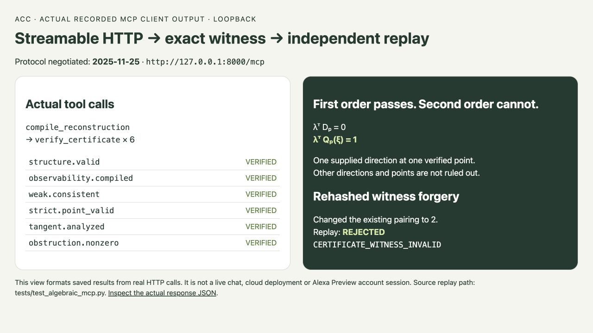

# Algebraic Constraint Compiler

**AI interprets. Compiler calculates. Verifier certifies.**

An exact, finite-dimensional workbench for algebraic reconstruction and
second-order deformation questions. It uses rational arithmetic and returns a
portable certificate that a separately written verifier can replay. The model
that explains a result is never the proof engine.

[Devpost project](https://devpost.com/software/algebraic-constraint-compiler)
· [2:48 demo](https://www.youtube.com/watch?v=szKNWGKXn9g)
· [Mathematical contract](docs/math-contract.md)



## The trust boundary

| Stage | Responsibility |
| --- | --- |
| **AI / agent** | Interprets a request, stages a typed candidate, and explains the result. |
| **Compiler** | Performs bounded exact computation over `Q`. |
| **Independent verifier** | Replays the certificate and fails closed on altered data. |

The main demo shows a direction that passes first order but has no second-order
correction at the supplied point. It also includes a positive example with an
exact correction and a rehashed-forgery check that the verifier rejects.

## Run it

Python 3.9+ and the standard library are enough for the core.

```bash
git clone https://github.com/Akari-H-111/algebraic-constraint-compiler.git
cd algebraic-constraint-compiler
python3 -B -m algebraic_compiler.workbench --port 8765
```

Open <http://127.0.0.1:8765>. Choose an example, optionally scale its exact
direction, then select **Prepare this question** and **Compile & check**. Export
the bundle and use **Replay independently** to test the result in a fresh
session.

For a non-browser path:

```bash
python3 -B -m algebraic_compiler compile examples/algebraic/second-order-obstructed.json | python3 -B -m algebraic_compiler verify -
python3 -B -m algebraic_compiler compile examples/algebraic/second-order-extends.json | python3 -B -m algebraic_compiler verify -
```

Both `VERIFIED` and certified `MATHEMATICALLY_REJECTED` are useful completed
computations. Malformed, unsupported, incomplete, and unverifiable inputs stay
distinct and fail closed.

## What is implemented

For fixed `A`, `V`, and `B` specifications over `Q`, the compiler supports:

1. typed structure validation and Leibniz observability compilation;
2. weak affine reconstruction with a full kernel or dual inconsistency witness;
3. validation of one supplied strict action point;
4. an exact tangent operator, kernel basis, and local rigidity classification;
5. a primary order-two check for one supplied tangent direction, yielding an
   exact correction or a dual non-membership witness.

## Reproduce the checks

```bash
# Core and local workbench; no dependencies
python3 -B -m unittest discover -s tests -p 'test_algebraic.py' -v
python3 -B -m unittest discover -s tests -p 'test_workbench.py' -v
python3 -B -m unittest discover -s tests -p 'test_deformation.py' -v

# Optional MCP transport test (Python >=3.10)
python3 -m venv .venv-acc
.venv-acc/bin/python -m pip install -e '.[mcp]'
.venv-acc/bin/python -B -m unittest discover -s tests -p 'test*.py' -v
```

The optional MCP adapter exposes `compile_reconstruction` and
`verify_certificate` over loopback-only Streamable HTTP. An MCP test reported
as skipped is not transport evidence.

## Scope, deliberately kept narrow

- Pass 4 validates a supplied point; it does not search the strict fiber.
- The order-two result is only for the supplied tangent direction at that point,
  modulo `t³`; it says nothing about higher orders or every deformation.
- Dimensions are bounded (`dim A ≤ 4`, `dim V ≤ 3`), with exact resource limits
  and a 2 MB wire payload.
- Passes 7–10 and the missing fixed-cubic backend are unsupported.
- The local workbench is loopback-only. There is no public deployment, app-owned
  LLM loop, or connected Alexa+ account claim.

Exact scalar encoding, canonical ordering, input/certificate digests, and the
independent verification contract are documented in the
[mathematical contract](docs/math-contract.md). Released under the [MIT License](LICENSE).
